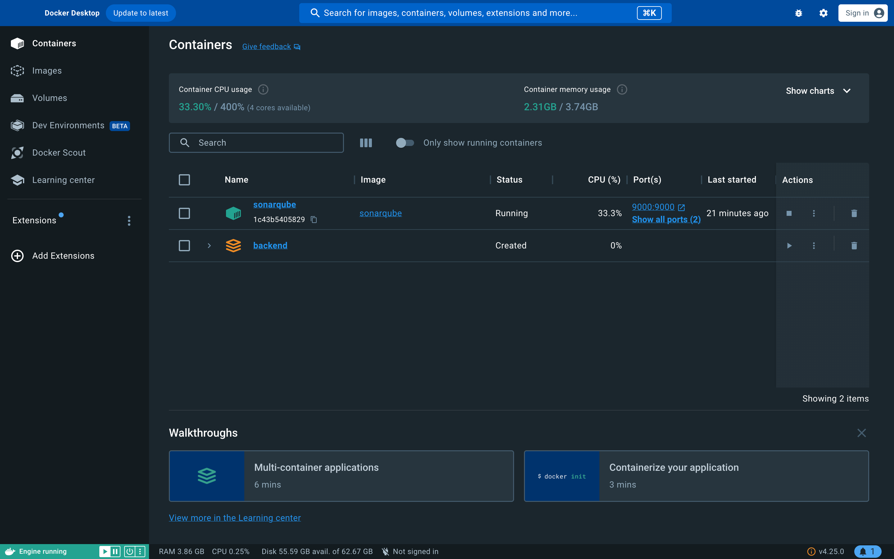
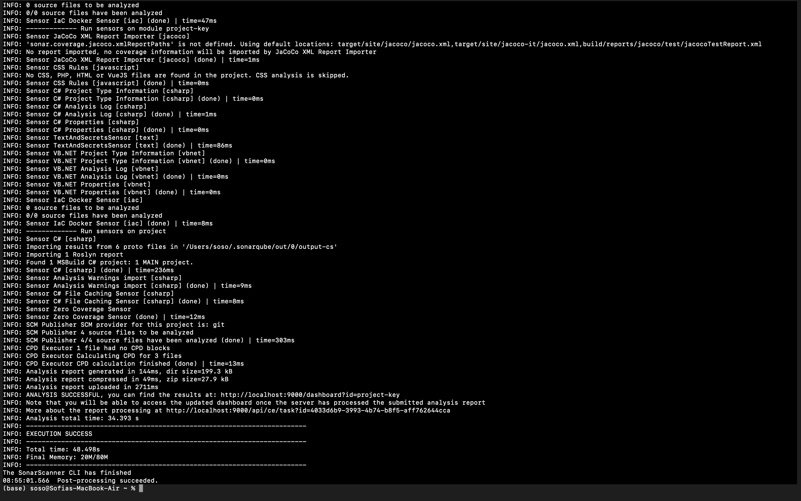
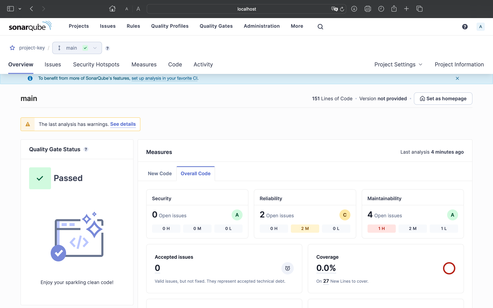
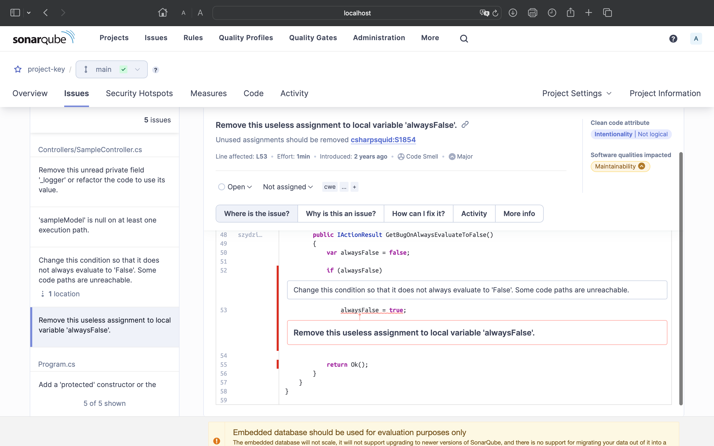

# ponderada-prog-s4-2

A tecnologia utilizada para realizar esse exercício foi o SonarQube. Este, é uma plataforma de código aberto para análise estática de código-fonte, que identifica e corrige automaticamente problemas de qualidade de código. Ele possui muitos benefícios, como a melhoria da qualidade do código antes da homologação, detecção precoce de vulnerabilidades e bugs, padronização do código e facilitação da colaboração entre equipes de desenvolvimento.

Como foi possível perceber, essa plataforma é extremamente vantajosa e vai ser algo que vou sempre tentar usar em meus projetos. Além disso, por mais que pareca simples, foi com esse exercício que aprendi a rodar uma aplicação direto pelo docker, e isso me deixou muito feliz.

Abaixo, estão imagens que comprovam que o SonarQube estava funcionando corretamente na aplicação testada:

Como é possível perceber nessa primeira imagem, o SonarQube está rodando no meu Docker.

 

Já nessa segunda imagem, eu comprovo que a aplicação web está funcionando pois o terminal não possui erros.

 

Na terceira imagem, é possível visualizar o menu principal do SonarQube com algumas estatísticas da aplicação que ele está analisando.

 

Por último, a quarta foto mostra uma funcionalidade do SonaQube de relatar ao usuário os erros que o seu código possui, como conceretá-los, quanto tempo essa ação irá demorar etc.

 

